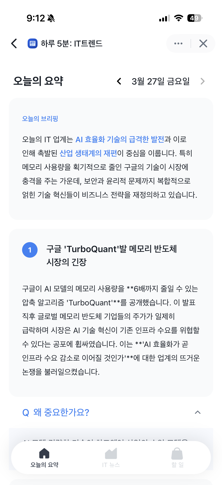
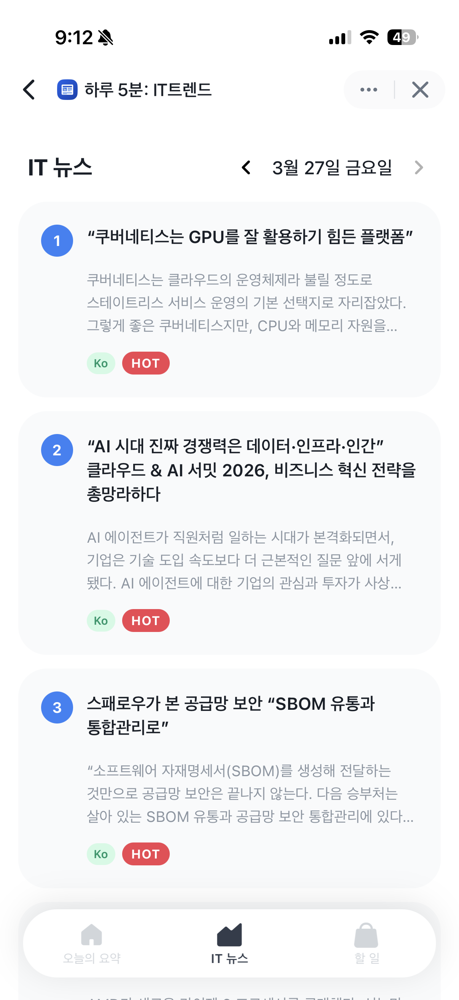
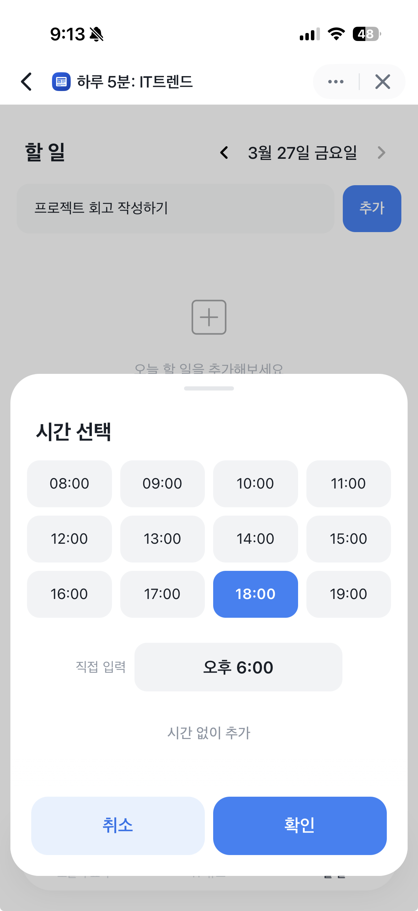
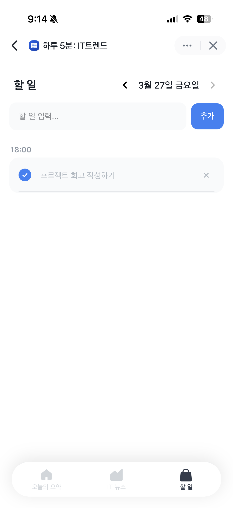
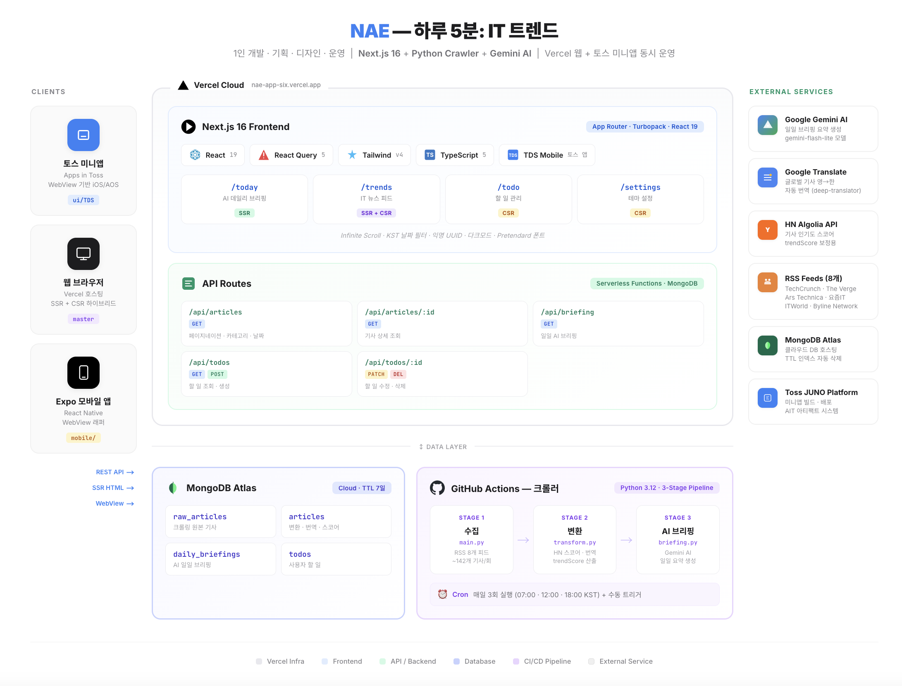

# NAE — 하루 5분: IT 트렌드

<p align="center">
  <strong>8개 IT 매체 자동 수집 → Gemini AI 데일리 브리핑 → 웹/모바일 서비스</strong>
</p>

<p align="center">
  <a href="https://nae-app-six.vercel.app">🌐 Live Demo</a> · 
  <a href="https://minion.toss.im/7bMQAGWp">📱 앱인토스</a> · 
  <a href="https://www.notion.so/5-IT-31834167454980ca9d33ebc2908213bb?source=copy_link">📄 상세 문서</a>
</p>

---

## 서비스 소개

오늘의 IT 트렌드를 한눈에 확인하고, 오늘의 할 일을 기록하는 데일리 웹/모바일 앱입니다.

TechCrunch, The Verge 등 글로벌 5개 + 국내 3개 매체에서 하루 최대 330건의 기사를 자동 수집하고, Gemini AI가 핵심 5개 이슈를 선정하여 데일리 브리핑을 생성합니다.

<!-- 스크린샷 삽입 -->
<p align="center">
  
  
  
  
</p>

---

## 기술 스택

| 영역      | 기술                                                                  |
| --------- | --------------------------------------------------------------------- |
| Frontend  | Next.js 16 · React 19 · TypeScript · Tailwind CSS v4 · Tanstack Query |
| Backend   | Next.js Route Handlers · MongoDB Atlas                                |
| AI & Data | Google Gemini Flash Lite · Python · feedparser · deep-translator      |
| Infra     | Vercel · GitHub Actions (1일 3회 자동 크롤링)                         |
| Mobile    | Expo 53 · React Native WebView · toss/tds-mobile                      |

---

## 아키텍처



---

## 주요 기능

### 📰 Today — AI 데일리 브리핑

- Gemini AI가 상위 35건 기사에서 핵심 5개 이슈를 선정
- 마크다운 형식의 브리핑 + 키워드 5개 생성
- SSR + ISR 5분 재검증으로 빠른 초기 로딩

### 📋 Trends — IT 뉴스 피드

- 글로벌/한국 기사를 trendScore 기준으로 정렬
- HN Algolia API 인기도 반영 (0~100점)
- 글로벌 기사 한국어 자동 번역

### ✅ Todo — 할 일 관리

- 날짜별 할 일 등록/수정/삭제
- 시간 선택 기능
- force-dynamic 렌더링으로 실시간 반영

---

## 성과

### Lighthouse

| 항목           | 개선 전 | 개선 후 |
| -------------- | ------- | ------- |
| Performance    | 94      | **96**  |
| Accessibility  | 80      | **95**  |
| Best Practices | 100     | 100     |
| SEO            | 100     | 100     |

### 접근성 개선 (80 → 95)

- 아이콘 버튼 `aria-label` 추가
- `user-scalable=no` 제거 (WCAG 2.1 핀치 줌 허용)
- 색상 대비 WCAG AA 4.5:1 이상 확보 (라이트/다크 모드)
- Heading 태그 순서 정리 (H1 → H2 → H3)

### 데이터 파이프라인

| 항목           | 수치                             |
| -------------- | -------------------------------- |
| RSS 소스       | 글로벌 5개 + 한국 3개            |
| 하루 최대 수집 | 330건                            |
| 자동 실행      | 3회/일 (07:00, 12:00, 18:00 KST) |
| AI 브리핑      | 상위 35건 → 핵심 5개 이슈        |

---

## 브랜치 전략

| 브랜치    | 용도                               | 렌더링           | 배포          |
| --------- | ---------------------------------- | ---------------- | ------------- |
| `master`  | 웹 서비스 + Route Handler API 서버 | SSR + ISR        | Vercel        |
| `ui/TDS`  | 앱인토스 전용 (toss/tds-mobile)    | CSR (use client) | 앱인토스 콘솔 |
| `mobile/` | Expo 모바일 앱                     | WebView          | iOS / Android |

---

## 실행 방법

```bash
# 의존성 설치
npm install

# 환경 변수 설정
cp .env.example .env.local
# MONGODB_URI, GEMINI_API_KEY 등 설정

# 개발 서버 실행
npm run dev

# 크롤러 수동 실행
cd crawler
pip install -r requirements.txt
python main.py
```

---

## 수집 매체

| 분류   | 매체                                                                        |
| ------ | --------------------------------------------------------------------------- |
| Global | TechCrunch · The Verge · Ars Technica · VentureBeat · MIT Technology Review |
| Korea  | 요즘IT · ITWorld Korea · Byline Network                                     |
