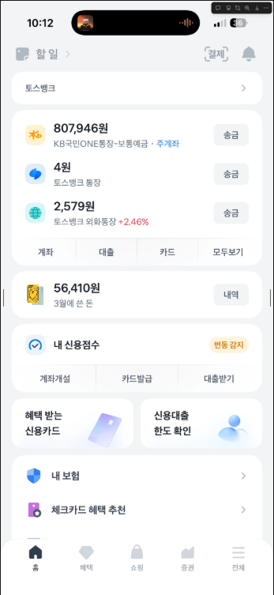

## 기획 의도

> it 뉴스를 찾아보기는 귀찮고 트렌드는 따라가고싶다

---

## 기능 리스트 - 기능별 필요 스택(라이브러리)

**큰기능**

1. 뉴스
   - 8시 12시 18시에 일 3회 크롤링 (알림), IT 트렌드 뉴스
   - 가장 중요한 뉴스 AI가 요약해주기

필요한 기술스택 - rss-parser / Hacker News Firebase API (공식 무료) / Reddit API / ZDNet Korea

1.  투두리스트
    - 오늘의 할 일 시간 별로 적기 (알림)
2.  알림 (추후 구현)
3.  애드센스
    - 개발자 커피 사주기 + 광고 제거로 수익
4.  UX/DX(중요) - 모바일 (사용자 경험을 중요시해서 가장 편하고 쉽게 사용할 수 있게) - 데스크탑 (옆에 가볍게 띄워놓고 볼 수있는 컴팩트한 디자인 ex) 무신사 / 데스크탑도 모바일과 비슷한 UI를 가짐) - DX - 코드분리, UI 컴포넌트 분리, 로직 분리, 타입정의를 잘 정해 유지보수와 확장성을 가짐
    

---

## 기획

화면은 총 3개

Today AI / Trends / Todo

- Today AI
  - 오늘의 AI 요약 - 바쁘면 이거만 보고 나갈수도있음 (앱인토스시 위젯도 가능)
  - AI 앵커가 읽어주는 브리핑 형식 UI → UI 자체를 대본처럼
  ### 아침 8시 → Today AI 생성
  - 오늘의 전체 흐름
  - 핵심 3개
  ***
  ### 12시 / 18시 → 업데이트 추가
  브리핑 하단에:
  ```tsx
  🔄 Midday Update
  - OpenAI 관련 후속 발표 추가
  - 한국 AI 스타트업 투자 소식 반영
  ```
- Trends
  - 오늘의 IT BEST 5
  - 리스트형식
  - 밑으로 내리면 무한스크롤
- Todo
  - 할 일 적기

---

데이터 구조(지금은 로그인 x)

- raw_articles

```tsx
{
  _id: ObjectId,
  title: string,
  url: string,
  source: "hn" | "reddit" | "rss" | "zdnet",
  sourceName: string,
  publishedAt: Date,
  thumbnail: string | null,
  summary: string | null,
  content: string | null,
  scoreRaw: number,         // HN 점수 or Reddit upvotes
  commentCount: number,
  createdAt: Date
}

```

- articles(가공된 뉴스)

```tsx
{
  _id: ObjectId,
  rawId: ObjectId,
  title: string,
  url: string,
  category: "global" | "korea",
  trendScore: number,
  aiSummaryShort: string,
  aiSummaryLong: string,
  keywords: string[],
  isHot: boolean,
  crawlBatch: "2026-03-03-08",
  createdAt: Date
}
```

- daily_briefings

```tsx
{
  _id: ObjectId,
  date: "2026-03-03",
  intro: string,
  mainIssues: [
    {
      title: string,
      summary: string,
      whyImportant: string,
      relatedArticleIds: ObjectId[]
    }
  ],
  closingSummary: string,
  keywords: string[],
  createdAt: Date
}
```

- todos

```tsx
{
  _id: ObjectId,
  userId: string,
  title: string,
  description: string,
  time: string, // "14:00"
  completed: boolean,
  date: string,
  createdAt: Date
}

```

---

색, 디자인 토스 참고

light

background: #f2f4f5

button: #f9f9f9

foreground: #fcfbfc

text: #9aa0a8

dark

background: #101012

button: #2c2d35

## text: #aeaeb2

## 기술 스택

- Next.js
- WebView
- Emotion
- Tanstack-query
- MongoDB
- Python(뉴스 데이터 수집, 크롤링)
- github action
- ci/cd
- vercel
- app in toss
